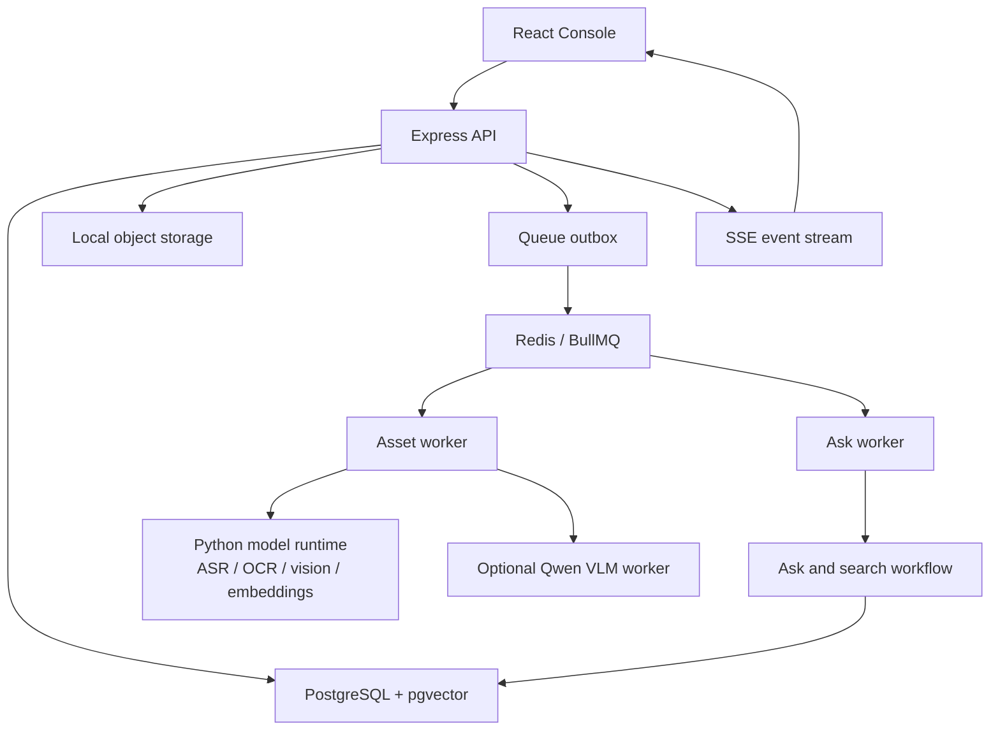

# Arion

Arion is a local-first video intelligence platform for ingesting videos, indexing multimodal evidence, and retrieving grounded moments with timeline, visual, speech, OCR, and sports-domain context.

It is built as an application stack rather than a notebook or single LLM script: uploads become durable jobs, model work runs behind service boundaries, evidence is persisted into PostgreSQL/pgvector, and the React console exposes the indexing and search workflow end to end.

## What Arion Does

- Ingests local video assets into asset groups.
- Runs asynchronous indexing jobs with durable checkpoints and retry support.
- Extracts media metadata, audio, speech regions, ASR, OCR, coarse visual profiles, scene windows, and keyframes.
- Builds searchable timeline segments with evidence sources, confidence, thumbnails, and embeddings.
- Stores text vectors and visual keyframe vectors in PostgreSQL with pgvector.
- Supports hybrid retrieval across lexical text, semantic vectors, visual vectors, source quality, domain evidence, and recency.
- Optionally runs a Qwen VLM worker for keyframe descriptions, domain refinement, and query planning fallback.
- Optionally enriches sports assets with football and American-football domain events, related knowledge, action spots, match identity, and player/team context.
- Exposes a React console for ingest, jobs, workflow inspection, search, clips, analysis, knowledge, webhooks, observability, and runtime capability checks.

## Current Shape

Arion is a local development and prototype system. It is designed around explicit runtime boundaries:

- Application state: PostgreSQL
- Queue execution: Redis + BullMQ
- Media files: local object-storage namespace under `.data/object-storage`
- Model runtimes: Python FastAPI service and optional VLM worker
- Frontend: Vite + React
- API and workers: TypeScript/Express services

The orchestration layer is custom TypeScript workflow code. Arion does not currently use LangChain or LangGraph.

## Architecture



The core indexing workflow is:

```text
upload -> probe -> local model runtime -> scene detection -> timeline
  -> keyframes -> video VLM -> detector/tracker -> domain evidence
  -> domain VLM -> text embeddings -> visual embeddings -> finalize
```

Each major stage is checkpointed so interrupted workers can resume without rebuilding outputs that are already persisted.

See [docs/architecture.md](docs/architecture.md) for the full system map.

## Requirements

- Node.js 20 or newer
- npm
- Docker Desktop or a compatible Docker runtime
- FFmpeg and ffprobe on the host for local development
- Python 3.10-3.12 for local AI services

PostgreSQL and Redis are started through Docker Compose in the standard local workflow. The app expects pgvector-backed PostgreSQL for normal operation.

## Quick Start

```bash
git clone git@github.com:iziz/Arion.git
cd Arion

cp .env.example .env
npm install

npm run dev
```

Default local endpoints:

| Service | URL |
| --- | --- |
| React console | `http://localhost:5173` |
| API | `http://localhost:8787` |
| PostgreSQL | `localhost:15432` |
| Redis | `localhost:16379` |

`npm run dev` starts Docker Redis/PostgreSQL, the Express API, the asset worker, the ask worker, and the Vite frontend.

## Full Local AI Setup

Install Python model dependencies into `.venv-ai`:

```bash
python3 -m venv .venv-ai
. .venv-ai/bin/activate
python -m pip install --upgrade pip
python -m pip install -r requirements.local-ai.txt
```

Then run the full stack:

```bash
npm run dev:full
```

`dev:full` starts the standard app plus:

- `scripts/arion_model_runtime_service.py` on `http://127.0.0.1:8792`
- `scripts/qwen_vlm_worker.py` on `http://127.0.0.1:8791`

Run diagnostics when a model backend fails to load:

```bash
npm run models:doctor:ai
curl http://127.0.0.1:8792/health
curl http://127.0.0.1:8791/health
```

## VLM Worker

The VLM worker defaults to Qwen2.5-VL. On Apple Silicon with `mlx-vlm`, the local default can use the MLX 4-bit model from `.env.example`:

```env
QWEN_VLM_BACKEND=mlx
QWEN_VLM_MODEL=mlx-community/Qwen2.5-VL-7B-Instruct-4bit
QWEN_VLM_MLX_MODEL=mlx-community/Qwen2.5-VL-7B-Instruct-4bit
VLM_WORKER_MODEL=mlx-community/Qwen2.5-VL-7B-Instruct-4bit
```

To test a larger MLX VLM, change those values before starting `npm run models:vlm:ai` or `npm run dev:full`, for example:

```env
QWEN_VLM_BACKEND=mlx
QWEN_VLM_MODEL=mlx-community/Qwen3-VL-30B-A3B-Instruct-4bit
QWEN_VLM_MLX_MODEL=mlx-community/Qwen3-VL-30B-A3B-Instruct-4bit
VLM_WORKER_MODEL=mlx-community/Qwen3-VL-30B-A3B-Instruct-4bit
```

Use larger VLMs only when the machine has enough unified memory. The VLM affects video segment descriptions, domain refinement, and query planning fallback. It does not replace detector/tracker evidence or visual embeddings.

## Common Commands

| Goal | Command |
| --- | --- |
| Start standard local development | `npm run dev` |
| Start full local AI development | `npm run dev:full` |
| Start Docker Redis/PostgreSQL only | `npm run infra:up` |
| Check Docker infrastructure | `npm run infra:check` |
| Check PostgreSQL/pgvector | `npm run db:check` |
| Run tests | `npm test` |
| Type-check and build | `npm run build` |
| Run model diagnostics | `npm run models:doctor:ai` |
| Rebuild embeddings | `npm run embeddings:rebuild` |
| Rebuild indexed assets and knowledge vectors | `npm run indexes:rebuild -- --all` |
| Run containerized app stack | `npm run docker:up` |
| Run containerized app + AI stack | `npm run docker:full` |

The full script reference is in [docs/npm-scripts.md](docs/npm-scripts.md).

## Docker Runtime

Standard infrastructure:

```bash
npm run infra:up
npm run infra:check
npm run infra:logs
npm run infra:down
```

Containerized app services:

```bash
npm run docker:up
npm run docker:full
npm run docker:down
```

Compose services:

| Service | Purpose |
| --- | --- |
| `postgres` | PostgreSQL 17 with pgvector |
| `redis` | Redis queue backend |
| `api` | Express API process |
| `asset-worker` | Long-running asset indexing jobs |
| `ask-worker` | Async ask/search operations |
| `web` | Nginx-served frontend |
| `model-runtime` | Python ASR/OCR/vision/embedding service |
| `vlm` | Qwen VLM FastAPI service |

Host development reads `.env`. Docker application services read `.env.docker`.

## API Overview

Health and operations:

- `GET /api/health`
- `GET /api/metrics`
- `GET /api/db/status`
- `GET /api/storage/status`
- `GET /api/observability`
- `GET /api/model-capabilities`
- `GET /api/events`
- `GET /api/events/stream`

Assets and indexes:

- `GET /api/indexes`
- `POST /api/indexes`
- `GET /api/indexes/:id`
- `PATCH /api/indexes/:id`
- `DELETE /api/indexes/:id`
- `GET /api/assets`
- `POST /api/assets`
- `POST /api/indexes/:id/assets`
- `GET /api/assets/:id`
- `DELETE /api/assets/:id`
- `POST /api/assets/:id/reindex`

Search and analysis:

- `POST /api/ask`
- `GET /api/ask/:id`
- `GET /api/search?q=...`
- `GET /api/search/plan?q=...`
- `GET /api/knowledge/answer?q=...`
- `GET /api/vector-search?q=...`
- `GET /api/visual-search?q=...`
- `POST /api/vector-store/rebuild`
- `POST /api/analyze`
- `POST /api/assets/:id/analyze`
- `GET /api/assets/:id/clips`
- `GET /api/assets/:id/clips/:segmentId`

Webhooks:

- `GET /api/webhooks`
- `POST /api/webhooks`
- `POST /api/webhooks/:id/test`
- `POST /api/webhooks/:id/retry`

## Indexing Evidence

Arion stores evidence at multiple levels:

- Asset-level intelligence: ASR, OCR, audio/VAD, visual profile, model traces
- Segment-level scene data: speech, subtitles, screen text, visual metadata, VLM descriptions, vision evidence
- Domain evidence: sports event labels, captions, scope, players, teams, match identity, action spots
- Embeddings: text passage vectors and visual keyframe vectors
- Operational evidence: job stage checkpoints, runtime stage status, logs, spans, and events

Coarse visual profiles are intentionally low-confidence cues. They summarize sampled frame color and frame-change signals, but they are not detector, tracker, VLM, or calibrated field evidence.

## Sports Knowledge

Sports-domain indexing is asset-group scoped. When enabled, Arion can attach related knowledge and structured events for:

- `sports.football`
- `sports.american_football`

Supported knowledge and template sources include:

- football-data imports
- UK football-data imports
- StatsBomb open data
- StatBunker imports
- nflverse imports
- SoccerNet-style action spotting
- American-football action spot templates

Useful commands:

```bash
npm run knowledge:nflverse
npm run knowledge:sync-current
npm run knowledge:vectors:rebuild
npm run knowledge:american-football-action-spots
```

More detail is available in:

- [docs/sports-domain-indexing.md](docs/sports-domain-indexing.md)
- [docs/domain-adaptive-video-intelligence.md](docs/domain-adaptive-video-intelligence.md)

## Configuration

Important environment variables:

| Variable | Purpose |
| --- | --- |
| `DATABASE_URL` | PostgreSQL connection string |
| `POSTGRES_REQUIRE_PGVECTOR` | Requires pgvector availability when true |
| `REDIS_URL` | Redis queue connection |
| `MEDIA_SERVING_MODE` | `local-static` or `disabled` |
| `UPLOAD_MAX_BYTES` | Maximum upload size |
| `PYTHON_RUNTIME_MODE` | `service` or `direct` |
| `PYTHON_RUNTIME_SERVICE_URL` | Combined Python model runtime URL |
| `ASR_RUNTIME_SERVICE_URL` | Optional split ASR runtime URL |
| `OCR_RUNTIME_SERVICE_URL` | Optional split OCR runtime URL |
| `VISION_RUNTIME_SERVICE_URL` | Optional split vision runtime URL |
| `EMBEDDING_RUNTIME_SERVICE_URL` | Optional split embedding runtime URL |
| `VLM_WORKER_URL` | Optional Qwen VLM worker URL |
| `OPENAI_API_KEY` | Optional OpenAI query planner |
| `OPENAI_QUERY_PLANNER` | Set `off` or `false` to disable OpenAI planner |
| `WHISPER_MODEL` | Local Whisper model name |
| `WHISPER_BACKEND` | `auto`, `whispercpp`, `faster-whisper`, or `openai-whisper` |
| `PADDLEOCR_LANG` | OCR language selection |
| `VISION_DETECTOR_BACKEND` | `auto`, `ultralytics`, or `rfdetr` |
| `VISION_TRACKER` | Ultralytics tracker config |
| `EMBEDDING_MODEL` | Text embedding model |
| `VISUAL_EMBEDDING_MODEL` | OpenCLIP visual embedding model |
| `CAPABILITY_*` | Runtime capability policy: `disabled`, `optional`, or `required` |

Start from [.env.example](.env.example). Do not commit local `.env` values.

## Verification

Run the TypeScript test suite:

```bash
npm test
```

Run type-check and frontend build:

```bash
npm run build
```

Check local infrastructure:

```bash
npm run infra:check
npm run db:check
```

Check model dependencies:

```bash
npm run models:doctor:ai
```

## Repository Map

| Path | Purpose |
| --- | --- |
| `src/` | React console |
| `server/` | Express API, workers, workflows, storage, search, domain logic |
| `shared/` | Shared TypeScript types and workflow metadata |
| `scripts/` | Runtime services, imports, rebuilds, maintenance tools |
| `tests/` | Node test runner suites |
| `docs/` | Architecture, script reference, and domain indexing notes |
| `docker-compose.yml` | Local and containerized service topology |
| `requirements.local-ai.txt` | Python AI runtime dependencies |

## Related Docs

- [Architecture](docs/architecture.md)
- [npm Scripts](docs/npm-scripts.md)
- [Sports Domain Indexing](docs/sports-domain-indexing.md)
- [Domain Adaptive Video Intelligence](docs/domain-adaptive-video-intelligence.md)

